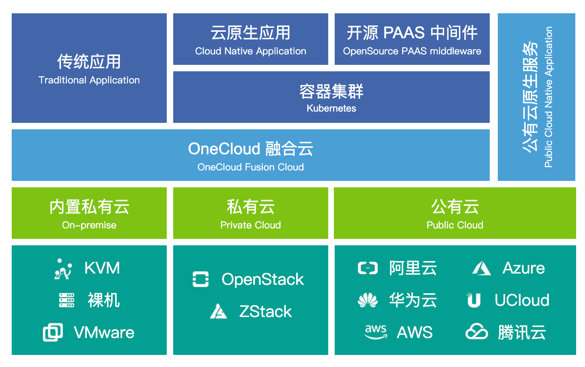

# Yunion OneCloud

 
 
 

### [README in Chinese](./README-CN.md)

## What is Yunion OneCloud?

Yunion OneCloud is an open source unified-IaaS cloud platform.

As its name sugguests, 'Yun' means 'cloud' in Chinese and 'Yunion OneCloud' means to unify many distinct clouds into the one that behaves like an integral cloud platform.

As trends show, the enterprise IT infrastructure in the future would be unavoidably heterogeneous and the public clouds should be the major infrastructure providers for many enterprises. Further, the infrastructure would most likely be prepared for the cloud-native applications running on Kubernetes. Yunion OneCloud is built to provide the cloud architecture for this scenario such that it is the middle layer between the underlying cloud infrustructures and the overlay kubernetes clusters across many clouds.

Many may consider Yunion OneCloud as a multi-cloud management platform (MCMP). Rather, we would view it as an IaaS platform as it does not only manage the resources and services from many clouds, but also hides the differences of underlying technologies and exposes one set of APIs that allow programatically interacting with the compute/storage/networking resources across many clouds.

Yunion OneCloud is working on abstracting APIs for the following resources:

* Compute, including virtual machines, images, etc.
* Storage, including disks, snapshots, object storages, etc.
* Networking, including load balancers, VPC, virtual networks, NAT gateways, security groups, etc.
* Accouting and billing, etc.
* ...

over the following many cloud providers:

* On-premise IT resources, including kvm VM, baremetal, VMware vsphere/ESXi, etc.
* Private clouds, including OpenStack, etc.
* Public clouds, including Aliyun, AWS, Azure, Tencent Cloud, Huawei Cloud, etc.

You are welcome to install and try Yunion OneCloud. Looking forward to your feedback.

## Installation

Please refers to [install & deployment](https://docs.yunion.io/docs/setup/) (currently in Chinese Only).

## Documentations

- [Yunion OneCloud Documents](https://docs.yunion.io/)

- [Swagger API](https://docs.yunion.cn/api/)

## Architecture

## Contribution

You are welcome to contribute to the project. Please refer to [CONTRIBUTING.md](./CONTRIBUTING.md) for guidelines.

## License

Apache License 2.0. See [LICENSE](./LICENSE) 。
