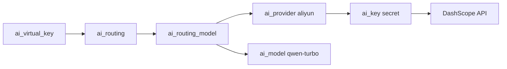

# aiproxy 功能测试（climc + 通义千问 DashScope）

本文用 **climc** 配置 aiproxy 资源，并用 **curl** 调用 OpenAI 兼容接口 `POST /v1/chat/completions` 做端到端验证。

> **安全**：请勿把 DashScope API Key 写进脚本、文档或提交到 Git。在 shell 里用环境变量 `DASHSCOPE_API_KEY` 传入。若 Key 曾在聊天/工单中泄露，请到阿里云控制台轮换。

## 前置条件

| 项 | 说明 |
|----|------|
| 服务 | aiproxy **主节点**已部署，Keystone 中已注册 `aiproxy` 服务及 public endpoint |
| 数据库 | 主节点已执行 `InitDB`，catalog 中已有 `aliyun` provider 及 `qwen-*` 模型（首次启动 master 会自动 seed） |
| 客户端 | 已 `source /etc/yunion/rcadmin`（或等价 rc 文件），`climc` 能正常 list |
| 工具 | `jq`（脚本与下文 curl 示例用于解析 JSON） |
| 网络 | aiproxy 节点能访问 `https://dashscope.aliyuncs.com` |

### 一键脚本（交互式，推荐）

从 catalog 选择 **模型提供商** 与 **model_key**，终端输入 API Key（或使用环境变量跳过输入），自动完成非流式 + 流式 chat：

```bash
source /etc/yunion/rcadmin
export CLIMC_OUTPUT_FORMAT=json
bash scripts/test/aiproxy/aiproxy-functional-test.sh
```

也可预置后减少交互（仍会选择模型、是否流式，除非全部用环境变量）：

```bash
export DASHSCOPE_API_KEY='你的 DashScope API Key'   # 或 AIPROXY_FT_API_KEY
export AIPROXY_FT_PROVIDER=aliyun
export AIPROXY_FT_MODEL=qwen-turbo
bash scripts/test/aiproxy/aiproxy-functional-test.sh
```

通义快捷入口：`bash scripts/test/aiproxy/aiproxy-functional-test-qwen.sh`（默认 `aliyun`）。  
小米 MiMo 见 [functional-test-climc-mimo.md](./functional-test-climc-mimo.md)（`aiproxy-functional-test-mimo.sh`）。

非交互（CI）：

```bash
export AIPROXY_FT_NONINTERACTIVE=1
export AIPROXY_FT_PROVIDER=aliyun
export AIPROXY_FT_MODEL=qwen-turbo
export AIPROXY_FT_API_KEY='...'
export AIPROXY_FT_SKIP_STREAM=1   # 可选，跳过流式
bash scripts/test/aiproxy/aiproxy-functional-test.sh
```

| 环境变量 | 说明 |
|----------|------|
| `AIPROXY_FT_PROVIDER` | `provider_key`（如 `aliyun`、`xiaomi`） |
| `AIPROXY_FT_MODEL` | `model_key`（如 `qwen-turbo`） |
| `AIPROXY_FT_API_KEY` | 上游 API Key（通用） |
| `DASHSCOPE_API_KEY` / `MIMO_API_KEY` | 按提供商兼容的旧变量名 |
| `AIPROXY_FT_SKIP_STREAM` | `1` 跳过流式；`0` 强制流式 |
| `AIPROXY_URL` | 留空则从 endpoint-list 解析 |

## 测试流程概览



## 0a. ai_provider 创建测试脚本

自定义 provider（非 catalog seed）创建与校验：

```bash
source /etc/yunion/rcadmin
bash scripts/test/aiproxy/aiproxy-ai-provider-create-test.sh
```

交互输入：资源名、`provider_key`、`base_url`、是否 `--enabled`。非交互示例：

```bash
export AIPROXY_PROVIDER_FT_NONINTERACTIVE=1
export AIPROXY_PROVIDER_FT_NAME=my-vllm
export AIPROXY_PROVIDER_FT_PROVIDER_KEY=my-vllm
export AIPROXY_PROVIDER_FT_BASE_URL=http://127.0.0.1:8000/v1
bash scripts/test/aiproxy/aiproxy-ai-provider-create-test.sh
```

`provider_key` 须全局唯一；与 InitDB catalog（如 `aliyun`）重复会失败。完整 config 可用 `AIPROXY_PROVIDER_FT_CONFIG='{"base_url":"..."}'`。

## 0. ai_proxy_node（多副本 / 路由绑定）

列出 aiproxy 实例节点（InitDB 后默认有 `primary`）：

```bash
climc ai-proxy-node-list
climc ai-proxy-node-show primary
```

注册 standby 节点（与进程内 `register` 心跳相同，一般由 standby 自动调用；手工测试可用）：

```bash
climc ai-proxy-node-register --address https://standby-host:30938 --hb-timeout 120
```

手工创建/更新节点（需具备写权限策略）：

```bash
climc ai-proxy-node-create standby-1 \
  --address https://standby-host:30938 \
  --domain aiproxy-standby.example.com \
  --hb-timeout 120 \
  --enabled

climc ai-proxy-node-update primary --address https://primary-host:30938 --domain aiproxy.example.com
climc ai-proxy-node-enable primary
climc ai-proxy-node-disable <node-id>
```

将 `ai_routing` 绑定到指定节点（chat 须走该节点 public endpoint）：

```bash
climc ai-routing-update aiproxy-ft-routing --ai-proxy-node-id primary
```

## 1. 检查 Keystone endpoint

```bash
climc endpoint-list --service aiproxy --interface public
```

应能看到当前 region 的 public URL（脚本会取第一条用于 curl）。

## 2. 检查 catalog（InitDB seed）

```bash
climc ai-provider-list --provider-key aliyun
climc ai-provider-show aliyun
climc ai-model-list --ai-provider-id aliyun --model-key qwen-turbo
```

确认 `provider_key=aliyun`，`config.base_url` 含 `https://dashscope.aliyuncs.com/compatible-mode`，且存在模型 `model_key=qwen-turbo`（catalog 固定 id / name：`aliyun-qwen-turbo`）。

## 3. 注册上游 API Key（ai_key）

将 DashScope Key 存为 `ai_key`，供 chat 时按 provider 加权选取：

```bash
climc ai-key-create qwen-dashscope-ft \
  --ai-provider-id aliyun \
  --secret "${DASHSCOPE_API_KEY}" \
  --weight 10 \
  --enabled
```

校验：

```bash
climc ai-key-list --ai-provider-id aliyun
climc ai-key-show qwen-dashscope-ft
```

确认 `ai_provider_id` 为 `aliyun`，且 **`enabled=true`**（`ai_key` 默认 disabled，创建时需 `--enabled`；若已存在但被禁用，执行 `climc ai-key-enable qwen-dashscope-ft`）。若曾用错误参数创建过同名 key，可更新：

```bash
climc ai-key-update qwen-dashscope-ft \
  --ai-provider-id aliyun \
  --secret "${DASHSCOPE_API_KEY}" \
  --weight 10
climc ai-key-enable qwen-dashscope-ft
```

（`secret` 在 API 中通常不回显，仅用于上游调用。）

## 4. 创建 Virtual Key（客户端鉴权）

```bash
climc ai-virtual-key-create aiproxy-ft-vk
```

记下返回的 `virtual_key`（形如 `sk-...`）。查看：

```bash
climc ai-virtual-key-list
climc ai-virtual-key-show aiproxy-ft-vk
```

Virtual key 归属当前 climc 用户的 **项目**；后续 `ai_routing` 须在同一项目（或共享到该项目）下。

## 5. 创建项目路由（ai_routing + models）

将项目内请求 `model=qwen-turbo` 指到 catalog 的 aliyun/qwen-turbo。

`models` 里 `ai_model_id` 使用 catalog 固定 id（与 name 相同，如 `aliyun-qwen-turbo`），或在指定 `ai_provider_id` 时也可填 **model_key**（如 `qwen-turbo`）：

```bash
climc ai-routing-create aiproxy-ft-routing \
  --priority 10 \
  --models '[{"ai_provider_id":"aliyun","ai_model_id":"qwen-turbo","priority":1}]'
```

或手工指定 name：

```bash
climc ai-routing-create aiproxy-ft-routing \
  --priority 10 \
  --models '[{"ai_provider_id":"aliyun","ai_model_id":"aliyun-qwen-turbo","priority":1}]'
```

查看绑定模型：

```bash
climc ai-routing-show aiproxy-ft-routing
```

也可事后调整：

```bash
climc ai-routing-set-models aiproxy-ft-routing \
  --models '[{"ai_provider_id":"aliyun","ai_model_id":"qwen-plus","priority":1}]'
```

可选：将规则绑定到指定 aiproxy 实例（多副本时）：

```bash
# 仅当需要固定到 primary 等节点时
climc ai-routing-update aiproxy-ft-routing --ai-proxy-node-id primary
```

## 6. Chat  completions（curl）

climc 暂无 chat 子命令，用 public endpoint + virtual key 调用（`-k` 跳过 TLS 证书校验，适用于自签或内网 HTTPS）：

```bash
AIPROXY_URL="${AIPROXY_URL:-$(climc endpoint-list --service aiproxy --interface public --limit 1 \
  --output-format json | jq -r '.data[0].url // empty')}"

VK="$(climc ai-virtual-key-show aiproxy-ft-vk --output-format json \
  | jq -r '.virtual_key')"

curl -k -sS "${AIPROXY_URL%/}/v1/chat/completions" \
  -H "Authorization: Bearer ${VK}" \
  -H "Content-Type: application/json" \
  -d '{
    "model": "qwen-turbo",
    "messages": [{"role": "user", "content": "用一句话介绍通义千问"}],
    "max_tokens": 128
  }' | jq .
```

**期望**：HTTP 200，JSON 含 `choices[0].message.content` 及 `usage`。

## 6b. 流式 Chat（curl / 脚本 step 7）

一键脚本在步骤 6 非流式成功后，默认继续执行流式校验（聚合 `choices[0].delta.content`）。跳过流式：

```bash
export AIPROXY_FT_SKIP_STREAM=1
```

手动 curl（SSE，`data: [DONE]` 结束）：

```bash
curl -k -sS -N -o /tmp/aiproxy-ft-stream.sse \
  "${AIPROXY_URL%/}/v1/chat/completions" \
  -H "Authorization: Bearer ${VK}" \
  -H "Content-Type: application/json" \
  -d '{"model":"qwen-turbo","stream":true,"messages":[{"role":"user","content":"hi"}],"max_tokens":64}'
```

期望：HTTP 200，响应体含 `data: {...}` 行且至少一条 `delta.content` 非空；最后为 `data: [DONE]`。

## 7. 负向用例（可选）

| 场景 | 操作 | 期望 |
|------|------|------|
| 错误 virtual key | `Authorization: Bearer sk-invalid` | 4xx，virtual key 无效 |
| 无路由 | `climc ai-routing-disable aiproxy-ft-routing` 或删除后再 chat | 404，无匹配 routing |
| 禁用 virtual key | `climc ai-virtual-key-disable aiproxy-ft-vk` | 4xx |
| provider 限制 | create vk 时 `--limits '{"allowed_ai_provider_ids":["openai"]}'` | 4xx，provider 不允许 |

## 8. 清理（可选）

```bash
climc ai-routing-delete aiproxy-ft-routing
climc ai-virtual-key-delete aiproxy-ft-vk
climc ai-key-delete qwen-dashscope-ft
```

## 常见问题

**`no ai_routing matched for virtual key project`**  
Virtual key 的 `project_id` 与 routing 所在项目不一致，或 routing 未 `enabled`、未共享到该项目。用同一 `climc` 项目上下文创建两者。

**`no api_key for ai_provider`**  
未创建 `ai_key`，且 `ai_provider.config` 里也没有 `api_key`。按步骤 3 创建 `ai_key`。

**DashScope 401/403**  
检查 `DASHSCOPE_API_KEY` 是否有效、是否开通对应模型。

**多副本 `ai_routing` 绑定其它节点**  
若 routing 指定了 `ai_proxy_node_id`，须访问该节点的 public endpoint，或去掉绑定。
