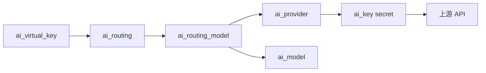

# aiproxy 功能测试（climc）

本文用 **climc** 配置 aiproxy 资源，并通过 **`climc ai-test-*`** 子命令或 **curl** 做端到端验证。

| 子命令 | 数据面路径 | 用途 |
|--------|------------|------|
| `ai-test-chat` | `POST /ai/openai/v1/chat/completions` | OpenAI 兼容 chat（非流式 + 流式） |
| `ai-test-anthropic` | `POST /ai/anthropic/v1/messages` | Anthropic Messages API |
| `ai-test-provider-create` | — | 创建自定义 `ai_provider` 并校验 |
| `ai-codex-config` | `GET /ai/openai/v1/models`、`POST /ai/openai/v1/responses` | 生成 Codex CLI 的 `config.toml` / `models_catalog.json` / `aiproxy.env` |

> **安全**：请勿将上游 API Key 写入文档或提交到 Git。使用环境变量传入；若 Key 曾泄露，请到对应云平台控制台轮换。

## 前置条件

| 项 | 说明 |
|----|------|
| 服务 | aiproxy **主节点**已部署，Keystone 中已注册 `aiproxy` 服务及 public endpoint |
| 数据库 | 主节点已执行 `InitDB`（初始化表结构；**不再**自动插入内置 SaaS `ai_provider`） |
| 客户端 | 已 `source /etc/yunion/rcadmin`（或等价 rc 文件），`climc` 能正常 list |
| 网络 | aiproxy 节点能访问目标上游（DashScope、MiMo、Anthropic 等） |

## 一键 E2E（交互式，推荐）

从已有 **ai_provider** 列表选择 **模型提供商** 与 **model_key**（或命令行指定 `--provider` / `--model`），终端输入 API Key（或使用环境变量跳过输入），自动完成 `ai_key` / `ai_virtual_key` / `ai_routing` 配置及 chat 校验：

```bash
source /etc/yunion/rcadmin
climc ai-test-chat
```

非交互（CI）：

```bash
export AIPROXY_TEST_NONINTERACTIVE=1
export AIPROXY_TEST_PROVIDER=aliyun
export AIPROXY_TEST_MODEL=qwen-turbo
export AIPROXY_TEST_API_KEY='...'
export AIPROXY_TEST_SKIP_STREAM=1   # 可选，跳过流式
climc ai-test-chat
```

### 环境变量

| 变量 | 说明 |
|------|------|
| `AIPROXY_TEST_PROVIDER` | `provider_key`（如 `aliyun`、`xiaomi`） |
| `AIPROXY_TEST_MODEL` | `model_key`（如 `qwen-turbo`） |
| `AIPROXY_TEST_API_KEY` | 上游 API Key（通用） |
| `AIPROXY_FT_*` | 同上（兼容旧变量名） |
| `DASHSCOPE_API_KEY` | 通义千问（`provider=aliyun`） |
| `MIMO_API_KEY` | 小米 MiMo（`provider=xiaomi`） |
| `MOONSHOT_API_KEY` | Moonshot / Kimi（`provider=moonshot`） |
| `ZHIPU_API_KEY` / `ZAI_API_KEY` | Z.AI / 智谱（`provider=zhipu`） |
| `ANTHROPIC_API_KEY` | Anthropic 直通 |
| `DEEPSEEK_API_KEY` | DeepSeek（Anthropic 兼容场景） |
| `AIPROXY_TEST_SKIP_STREAM` | `1` 跳过流式；`0` 强制流式 |
| `AIPROXY_TEST_KEEP_RESOURCES` | `1` 测试结束后**保留**本次创建的资源（默认自动清理） |
| `AIPROXY_URL` | 留空则从 `endpoint-list` 解析 |

`ai-test-*` 会在测试过程中自动创建缺失的依赖（`ai_model`、`ai_key`、`ai_virtual_key`、`ai_routing` 等），**不会**自动创建 `ai_provider`；交互式 `ai-test-chat` 需环境中至少有一个 `ai_provider`，非交互请先用 `climc ai-provider-create` 创建对应 `provider_key` 的供应商（或使用 `ai-test-provider-create`）。**测试结束（成功或失败）后自动删除本次创建的资源**。临时修改的 `ai_provider.config.base_url` 会还原。仅删除本次新建项，测试前已存在的同名资源不会被删。

保留资源以便排查：`climc ai-test-chat --keep-resources` 或 `export AIPROXY_TEST_KEEP_RESOURCES=1`。

`ai-test-chat` 按 provider 自动命名资源（可用 `--key-name`、`--vk-name`、`--routing-name` 覆盖），默认形如 `aiproxy-test-{provider}`。

## 按模型提供商快速开始

### 通义千问（DashScope / aliyun）

需存在 `provider_key=aliyun` 的 `ai_provider`（可 `climc ai-provider-create`）；`ai-test-chat` 会按需创建 `ai_model` 等测试资源。上游 `https://dashscope.aliyuncs.com/compatible-mode`。

```bash
export DASHSCOPE_API_KEY='你的 DashScope API Key'
climc ai-test-chat --provider aliyun --model qwen-turbo --api-key "$DASHSCOPE_API_KEY"
```

### 小米 MiMo（xiaomi）

需存在 `provider_key=xiaomi` 的 `ai_provider`；上游 `https://api.xiaomimimo.com`。

```bash
export MIMO_API_KEY='你的 MiMo API Key'
climc ai-test-chat --provider xiaomi --model mimo-v2-flash --api-key "$MIMO_API_KEY"
```

其它 catalog 模型：`mimo-v2.5-pro`、`mimo-v2-pro`、`mimo-v2.5`、`mimo-v2-omni`（id 形如 `xiaomi-mimo-v2.5-pro`）。

```bash
export AIPROXY_TEST_PROVIDER=xiaomi AIPROXY_TEST_MODEL=mimo-v2.5-pro
climc ai-test-chat --api-key "$MIMO_API_KEY"
```

MiMo 与 DashScope 测试应使用独立的 vk/routing/key 名称，避免混用同一 routing 的 model 列表。

### Moonshot / Kimi（moonshot）

`provider_key` 固定为 `moonshot`；通过 `config.base_url` 区分国内/国际（控制台创建时选择区域会自动写入）：

| 区域 | `config.base_url` |
|------|-------------------|
| 国内 | `https://api.moonshot.cn` |
| 国际 | `https://api.moonshot.ai` |

上游 OpenAI 兼容（SDK `base_url` 为 `https://api.moonshot.cn/v1` 或 `https://api.moonshot.ai/v1`）。未设置 `base_url` 时默认国内。

```bash
export MOONSHOT_API_KEY='你的 Moonshot API Key'
climc ai-test-chat --provider moonshot --model kimi-k2.6 --api-key "$MOONSHOT_API_KEY"
# 国际区（临时覆盖 base_url）：
climc ai-test-chat --provider moonshot --model kimi-k2.6 --api-key "$MOONSHOT_API_KEY" --base-url https://api.moonshot.ai
```

其它 catalog 模型：`kimi-k2.7-code`、`kimi-k2.5`、`moonshot-v1-8k` 等（id 形如 `moonshot-kimi-k2.6`）。

### Z.AI / 智谱（zhipu）

控制台展示为 **Z.AI**，`provider_key` 固定为 **`zhipu`**。上游 OpenAI 兼容 base 为 `https://open.bigmodel.cn/api/paas/v4`；Anthropic 兼容 base 为 `https://open.bigmodel.cn/api/anthropic`。支持 `config.api_mode=openai|anthropic`（与 DeepSeek 类似的双 API 模式）。

**OpenAI 兼容（默认 `api_mode=openai`）**：

```bash
export ZHIPU_API_KEY='你的智谱 API Key'
climc ai-test-chat --provider zhipu --model glm-5.2 --api-key "$ZHIPU_API_KEY"
```

**Anthropic 兼容（`config.api_mode=anthropic`）**：aiproxy 将 Anthropic SDK 请求直通 `https://open.bigmodel.cn/api/anthropic/v1/messages`（`base_url` 可仍填 OpenAI 默认，由 aiproxy 自动切换）。

```bash
climc ai-test-anthropic --provider zhipu --model glm-5.2 \
  --api-key "$ZHIPU_API_KEY" --upstream-base-url https://open.bigmodel.cn/api/anthropic
```

创建 provider 示例：

```json
{
  "generate_name": "my-zhipu",
  "provider_key": "zhipu",
  "secret": "<zhipu-api-key>",
  "config": {
    "base_url": "https://open.bigmodel.cn/api/paas/v4",
    "api_mode": "openai"
  }
}
```

其它 catalog 模型：`glm-5.1`、`glm-5-turbo`、`glm-4.7`、`glm-4.7-flash` 等（id 形如 `zhipu-glm-5.2`）。

非交互：

```bash
export AIPROXY_TEST_PROVIDER=zhipu AIPROXY_TEST_MODEL=glm-5.2
export AIPROXY_TEST_API_KEY="$ZHIPU_API_KEY"
climc ai-test-chat
```

### Anthropic Messages API

数据面 **`POST /ai/anthropic/v1/messages`**，认证为 `Authorization: Bearer <virtual_key>`（**不是**上游 Anthropic/DeepSeek API Key）。

Claude Code / Anthropic SDK 在正式请求前会对 base URL 发 **`HEAD /ai/anthropic/`** 做连通性探测；aiproxy 已返回 `204`。对 **`HEAD /ai/anthropic/v1/messages`** 无 virtual key 时返回 `401`（表示路由存在、需鉴权）。

**Anthropic 直通**（catalog `provider_key=anthropic`）：

```bash
export ANTHROPIC_API_KEY='sk-ant-...'
climc ai-test-anthropic --provider anthropic --model claude-sonnet-4-5 --api-key "$ANTHROPIC_API_KEY"
```

**OpenAI 兼容后端（DeepSeek，翻译模式）**：`config.api_mode=openai`（默认）；客户端仍用 Anthropic SDK；aiproxy 转换为 OpenAI `chat/completions` 转发。

| 资源 | 示例 |
|------|------|
| `ai_provider.provider_key` | `deepseek` 或 `openai` |
| `ai_provider.config.base_url` | `https://api.deepseek.com` |
| `ai_provider.config.api_mode` | `openai`（可省略） |
| `ai_model.model_key` | `deepseek-chat` |

```bash
export DEEPSEEK_API_KEY='...'
climc ai-test-anthropic --provider deepseek --model deepseek-chat \
  --api-key "$DEEPSEEK_API_KEY" --upstream-base-url https://api.deepseek.com
```

**DeepSeek 原生 Anthropic 模式**：`provider_key=deepseek` 且 `config.api_mode=anthropic`；aiproxy 将 Anthropic SDK 请求直通 DeepSeek `https://api.deepseek.com/anthropic/v1/messages`（`base_url` 可仍填 `https://api.deepseek.com`，由 aiproxy 自动补 `/anthropic`）。

创建 provider 时在顶层 `secret` 写入上游密钥（PostCreate 自动创建关联 `ai_key`）；`config` 仅保留 `base_url` / `api_mode`：

```json
{
  "generate_name": "my-deepseek",
  "provider_key": "deepseek",
  "secret": "<deepseek-api-key>",
  "config": {
    "base_url": "https://api.deepseek.com",
    "api_mode": "anthropic"
  }
}
```

`config.api_key` 已不再支持；请在「供应商密钥」Tab 或独立 `ai_key` 资源中管理密钥。

OpenAI SDK 经 `/ai/openai/v1/chat/completions` 访问同一 provider 时，也会按 `api_mode=anthropic` 转为 Anthropic Messages 上游。

Anthropic SDK / Claude Code 配置（`base_url` 指向 aiproxy，**不要**加 `/v1`；`api_key` 为 **virtual_key**）：

```python
import anthropic
client = anthropic.Anthropic(
    base_url=f"{AIPROXY_URL}/ai/anthropic",  # 正确：SDK 自行拼 /v1/messages
    api_key=VIRTUAL_KEY,                     # aiproxy virtual_key，不是上游 Key
)
client.messages.create(model="claude-sonnet-4-5", max_tokens=128, messages=[...])
```

环境变量等价配置：

```bash
export ANTHROPIC_BASE_URL="${AIPROXY_URL}/ai/anthropic"   # 勿写成 .../ai/anthropic/v1
export ANTHROPIC_API_KEY="${VIRTUAL_KEY}"
```

| 配置项 | 正确 | 错误 |
|--------|------|------|
| `ANTHROPIC_BASE_URL` | `https://host/ai/anthropic` | `.../ai/anthropic/v1`（会变成 `/v1/v1/messages`） |
| API Key | aiproxy **virtual_key** | 上游 Anthropic / DeepSeek key |

## Codex CLI 接入（ai-codex-config）

[Codex CLI](https://github.com/openai/codex) 经 OpenAI **Responses API** 访问模型。`climc ai-codex-config` 根据已有 `ai_virtual_key` 生成 Codex 配置（对齐 [moon-bridge](https://github.com/yunionio/moon-bridge) 的 `-print-codex-config` 方式）：`config.toml`、`models_catalog.json` 与 `aiproxy.env`。`base_url` 指向 `{网关根 URL}/ai/openai/v1`（指定 `--routing` 时优先使用该 route 绑定 `ai_proxy_node` 的 **access_address** 作为网关根 URL），`wire_api = "responses"`。Codex 通过环境变量 `OPENAI_API_KEY` 携带 **virtual_key**（不是上游 Key，也不使用 `auth.json`），启动前需 `source aiproxy.env`。

与 `ai-test-chat` 的关系：`ai-test-chat` 验证 chat completions 链路；`ai-codex-config` 为 Codex 客户端生成 Responses API 配置。二者共用同一套 `ai_virtual_key` / `ai_routing` 资源。

### 参数

| 参数 | 说明 |
|------|------|
| `--virtual-key` | **必填**，`ai_virtual_key` 名称或 id |
| `--model` | 客户端 model id（扁平或 `route/catalog`）；省略时从 `--routing` 的 `model_key` 或 `GET /ai/openai/v1/models` 推断 |
| `--routing` | 可选，`ai_routing` 名称/id；指定后 `base_url` 优先取该 route 绑定 `ai_proxy_node.access_address`，且 `models_catalog.json` 仅含该 route 模型（与 `GET /models` 结果取交集） |
| `--aiproxy-url` | 可选，网关根 URL 覆盖；未指定且带 `--routing` 时用 route 接入地址，否则 `AIPROXY_URL` 或 `endpoint-list` |
| `--codex-home` | 可选，写入 `config.toml`、`models_catalog.json` 与 `aiproxy.env`（`aiproxy.env` 权限 `0600`）；建议使用独立目录（如 `$HOME/.codex-aiproxy`），避免覆盖已有 `~/.codex` |
| `--list-models` | 仅列出该 vk 可见的 model id 后退出 |
| `--provider-name` | `config.toml` 中 `model_provider` 段名，默认 `aiproxy` |

指定 `--routing` 时，`models_catalog.json` 的模型列表为 `GET /ai/openai/v1/models`（virtual key 可见）与该 route 绑定 catalog 推导出的 client model id 的**交集**。可用 `climc ai-model-list --ai-routing-id <routing>` 查看该 route 绑定的 catalog 模型。

### 示例

打印到 stdout（默认）：

```bash
climc ai-codex-config --virtual-key aiproxy-test-aliyun-vk --model qwen-turbo
```

列出该 vk 可见模型：

```bash
climc ai-codex-config --virtual-key aiproxy-test-aliyun-vk --list-models
```

写入独立目录后启动 Codex（不覆盖已有 `~/.codex`）：

```bash
# 1. 指定独立配置目录（默认 ~/.codex-aiproxy，不覆盖 ~/.codex）
CODEX_HOME_DIR="${CODEX_HOME_DIR:-$HOME/.codex-aiproxy}"

# 2. 创建目录；若失败，后续写入 config.toml 会报错
mkdir -p "$CODEX_HOME_DIR"

# 3. 生成 config.toml、models_catalog.json、aiproxy.env（需已 source rc 且 climc 可用）
climc ai-codex-config \
  --virtual-key aiproxy-test-aliyun-vk \
  --routing aiproxy-test-aliyun-routing \
  --codex-home "$CODEX_HOME_DIR"

# 4. 加载 OPENAI_API_KEY（virtual_key）并以独立 CODEX_HOME 启动 Codex，工作目录为当前项目
source "$CODEX_HOME_DIR/aiproxy.env" && CODEX_HOME="$CODEX_HOME_DIR" codex --cd "$PWD"
```

生成内容示例：

**config.toml**

```toml
model = "qwen-turbo"
model_provider = "aiproxy"
model_catalog_json = "/home/user/.codex-aiproxy/models_catalog.json"

[model_providers.aiproxy]
name = "Cloudpods AI Gateway"
base_url = "https://<host>/ai/openai/v1"
wire_api = "responses"
env_key = "OPENAI_API_KEY"
env_key_instructions = "Run: source /home/user/.codex-aiproxy/aiproxy.env"

[mcp_servers.deepwiki]
url = "https://mcp.deepwiki.com/mcp"
startup_timeout_sec = 3600
tool_timeout_sec = 3600
```

**models_catalog.json**（节选）：包含该 virtual key 可见模型的 Codex 元数据（`base_instructions`、`truncation_policy`、`shell_type`、`input_modalities` 等），避免 Codex 回退到内置 preset。若绑定 `ai_model` 已启用 Visual（`visual_active`：`config.extensions.visual.enabled` + `visual_provider_id` + `visual_model_key`），对应条目会写入 `input_modalities: ["text","image"]`，使 Codex 按多模态发图。

**aiproxy.env**

```bash
export OPENAI_API_KEY="<virtual_key>"
```

## 测试流程概览



## ai_provider 创建测试

### 自定义供应商（provider_key=custom）

用户自建网关，需填写完整 `base_url`、顶层 `secret` 与 `api_mode`（openai / anthropic）：

```json
{
  "generate_name": "my-gateway",
  "provider_key": "custom",
  "secret": "sk-xxx",
  "config": {
    "base_url": "https://llm.example.com/v1",
    "api_mode": "openai"
  }
}
```

Anthropic Messages 上游示例：

```json
{
  "generate_name": "my-anthropic-gateway",
  "provider_key": "custom",
  "secret": "sk-ant-xxx",
  "config": {
    "base_url": "https://llm.example.com/anthropic",
    "api_mode": "anthropic"
  }
}
```

创建后不会自动注入 catalog 模型；须手动创建 `ai_model` 并配置路由。

### 自托管 provider

```bash
climc ai-test-provider-create
```

非交互示例：

```bash
export AIPROXY_PROVIDER_TEST_NONINTERACTIVE=1
climc ai-test-provider-create \
  --name my-vllm --provider-key my-vllm \
  --base-url http://127.0.0.1:8000/v1 --enabled
```

`provider_key` 须全局唯一。完整 config 可用 `--config '{"base_url":"..."}'` 或 `AIPROXY_PROVIDER_TEST_CONFIG`。

## ai_proxy_node（多副本 / 路由绑定）

```bash
climc ai-proxy-node-list
climc ai-proxy-node-show primary
climc ai-proxy-node-register --address https://standby-host:30938 --hb-timeout 120
```

将 `ai_routing` 绑定到指定节点（chat 须走该节点 public endpoint）：

```bash
climc ai-routing-update aiproxy-test-routing --ai-proxy-node-id primary
```

创建 `ai_routing` 时若省略 `--ai-proxy-node-id`，默认绑定 `primary` 节点。

## 手动步骤（以 aliyun / qwen-turbo 为例）

以下步骤与 `climc ai-test-chat` 等价，便于理解各资源关系；其它 provider 替换 `aliyun`、`qwen-turbo` 及对应 API Key 即可。

### 1. 检查 Keystone endpoint

```bash
climc endpoint-list --service aiproxy --interface public
```

### 2. 检查 catalog

```bash
climc ai-provider-show aliyun
climc ai-model-show aliyun-qwen-turbo
```

小米 MiMo：`climc ai-provider-show xiaomi`、`climc ai-model-show xiaomi-mimo-v2-flash`。

### 3. 注册上游 API Key（ai_key）

```bash
climc ai-key-create qwen-dashscope-test \
  --ai-provider-id aliyun \
  --secret "${DASHSCOPE_API_KEY}" \
  --weight 10 \
  --enabled
```

`ai_key` 默认 disabled，创建时需 `--enabled`。

### 4. 创建 Virtual Key

```bash
climc ai-virtual-key-create aiproxy-test-vk
climc ai-virtual-key-show aiproxy-test-vk
```

Virtual key 归属当前 climc 用户的 **项目**；`ai_routing` 须在同一项目（或共享到该项目）下。

### 5. 创建项目路由

```bash
climc ai-routing-create aiproxy-test-routing \
  --priority 10 \
  --model-key qwen-turbo \
  --models '[{"ai_provider_id":"aliyun","ai_model_id":"qwen-turbo","priority":1}]'
```

### 6. Chat completions（curl）

```bash
AIPROXY_URL="${AIPROXY_URL:-$(climc endpoint-list --service aiproxy --interface public --limit 1 \
  --output-format json | jq -r '.data[0].url // empty')}"

VK="$(climc ai-virtual-key-show aiproxy-test-vk --output-format json | jq -r '.virtual_key')"

curl -k -sS "${AIPROXY_URL%/}/ai/openai/v1/chat/completions" \
  -H "Authorization: Bearer ${VK}" \
  -H "Content-Type: application/json" \
  -d '{
    "model": "qwen-turbo",
    "messages": [{"role": "user", "content": "用一句话介绍通义千问"}],
    "max_tokens": 128
  }' | jq .
```

**期望**：HTTP 200，JSON 含 `choices[0].message.content` 及 `usage`。

### 6b. 流式 Chat

`climc ai-test-chat` 默认在非流式成功后继续流式校验。跳过：`climc ai-test-chat --skip-stream`。

```bash
curl -k -sS -N "${AIPROXY_URL%/}/ai/openai/v1/chat/completions" \
  -H "Authorization: Bearer ${VK}" \
  -H "Content-Type: application/json" \
  -d '{"model":"qwen-turbo","stream":true,"messages":[{"role":"user","content":"hi"}],"max_tokens":64}'
```

Anthropic 流式与非流式均走 `/ai/anthropic/v1/messages`，请求体设置 `"stream": true` 即可。

## 负向用例（可选）

| 场景 | 操作 | 期望 |
|------|------|------|
| 错误 virtual key | `Authorization: Bearer sk-invalid` | 4xx |
| 无路由 | disable 或删除 routing 后再 chat | 404 |
| 禁用 virtual key | `climc ai-virtual-key-disable aiproxy-test-vk` | 4xx |
| provider 限制 | vk `--limits '{"allowed_ai_provider_ids":["openai"]}'` | 4xx |

## 清理

`ai-test-*` 默认在结束时自动清理（见上文 `AIPROXY_TEST_KEEP_RESOURCES`）。手动清理示例（仅在使用 `--keep-resources` 或清理失败时需要）：

DashScope：

```bash
climc ai-routing-delete aiproxy-test-aliyun-routing
climc ai-virtual-key-delete aiproxy-test-aliyun-vk
climc ai-key-delete aiproxy-test-aliyun
```

MiMo 示例（若使用独立资源名）：

```bash
climc ai-routing-delete aiproxy-test-xiaomi-routing
climc ai-virtual-key-delete aiproxy-test-xiaomi-vk
climc ai-key-delete aiproxy-test-xiaomi
```

## 常见问题

**`no ai_routing matched for virtual key project`**  
Virtual key 与 routing 的项目不一致，或 routing 未 `enabled`、未共享到该项目。

**`add an enabled ai_key with secret for this provider`**  
未创建启用的 `ai_key`，或密钥为空。创建 provider 时使用顶层 `secret`，或在「供应商密钥」Tab 手动添加。

**DashScope / MiMo 401/403**  
检查对应环境变量中的 API Key 是否有效、模型是否已开通。

**多副本 `ai_routing` 绑定其它节点**  
若 routing 指定了 `ai_proxy_node_id`，须访问该节点的 public endpoint，或去掉绑定。

**MiMo 与 DashScope 资源冲突**  
各 provider 使用独立的 vk/routing/key 名称，勿共用同一 routing 的 model 列表。
