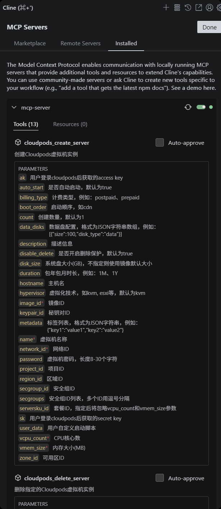

# mcp-server使用文档

- 使用市面上的主流mcp-server客户端，如cline、cursor等均可
- 这里以cline为例


## 配置mcp-server

可以选择使用stdio模式或者是sse模式，源码中默认使用sse模式

- sse模式：

````json
{
  "mcpServers": {
    "cloudpods-sse": {
      "url": "http://localhost:12001/sse"
    }
  }
}
````
- stdio模式：
````json
{
  "mcpServers": {
    "mcp-server": {
      "disabled": false,
      "timeout": 60,
      "type": "stdio",
      "command": "D:/ospp/cloudpods/cmd/mcp-server/mcp-server.exe",
      "args": [
        "config",
        "D:/ospp/cloudpods/pkg/mcp-server/config/mcp-server.yaml"
      ]
    }
  }
}
````




## 通过大模型和mcp-server交互

1. 登录cloudpods前端界面
2. 获取accessKey和secretKey

这里通过命令行和climc工具创建ak和sk

````bash
climc credential-create-aksk
````

3. 在和AI对话时提供accessKey和secretKey

## 使用用例示例

目前mcp-server总共提供了15个功能：

资源查询：

- cloudpods_list_images: 查询镜像列表
- cloudpods_list_networks： 查询网络列表
- cloudpods_list_regions：查询区域列表
- cloudpods_list_servers：查询虚拟机实例列表
- cloudpods_list_serverskus：查询服务器规格列表
- cloudpods_list_storages：查询存储列表
- cloudpods_list_vpcs：查询 VPC 列表

资源操作：

- cloudpods_create_server：创建虚拟机实例
- cloudpods_delete_server：删除虚拟机实例
- cloudpods_start_server：启动虚拟机实例
- cloudpods_stop_server：停止虚拟机实例
- cloudpods_reset_server_password：重置虚拟机密码
- cloudpods_get_server_monitor：获取Cloudpods虚拟机监控信息
- cloudpods_get_server_stats：获取Cloudpods虚拟机实时统计信息

## 测试环境信息
- **认证信息**:
    - Access Key: `73e97540cabe4a7580fc469760df5e80`
    - Secret Key: `enh2ZXRYZUhWdHpjeHJENVdoQmQyUGNnbXhFS2dneUQ=`
- **Cloudpods 实例**: `https://10.21.76.40`

---

## 1. cloudpods_list_images - 查询镜像列表

### 用户提示词示例

- "帮我查询云平台的镜像列表，要求显示前10条（从第1条开始），筛选条件为操作系统类型是Linux或Windows，关键词包含'centos'。"
- "列出当前账号下可用的镜像，最多返回5条，跳过前3条（即从第4条开始），只显示类型为Ubuntu的镜像。"

### MCP实际接收参数
```json
{
  "ak": "73e97540cabe4a7580fc469760df5e80",
  "sk": "enh2ZXRYZUhWdHpjeHJENVdoQmQyUGNnbXhFS2dneUQ=",
  "limit": "10",
  "offset": "0",
  "search": "",
  "os_types": "Linux,Windows"
}
```

### 返回结果
```json
{
  "images": [],
  "query_info": {
    "count": 0,
    "limit": 10,
    "offset": 0,
    "os_types": ["Linux", "Windows"],
    "search": "",
    "total": 0
  },
  "summary": {
    "has_more": false,
    "next_offset": 0,
    "returned_count": 0,
    "total_images": 0
  }
}
```

---

## 2. cloudpods_list_networks - 查询网络列表

### 用户提示词示例

- "查询VPC（ID: vpc-default）下的网络列表，显示前5条（从第1条开始），筛选名称包含'生产环境'的网络。"
- "列出当前区域默认VPC中的网络，最多返回8条，跳过前2条，关键词为'测试'。"

### MCP实际接收参数
```json
{
  "ak": "73e97540cabe4a7580fc469760df5e80",
  "sk": "enh2ZXRYZUhWdHpjeHJENVdoQmQyUGNnbXhFS2dneUQ=",
  "limit": "10",
  "offset": "0",
  "search": "",
  "vpc_id": "default"
}
```

### 返回结果
```json
{
  "networks": [],
  "query_info": {
    "count": 0,
    "limit": 10,
    "offset": 0,
    "search": "",
    "total": 0,
    "vpc_id": "default"
  },
  "summary": {
    "has_more": false,
    "next_offset": 0,
    "returned_count": 0,
    "total_networks": 0
  }
}
```

---

## 3. cloudpods_list_regions - 查询区域列表

### 用户提示词示例

- "查询云服务商OneCloud支持的所有区域，显示前10条（从第1条开始），筛选名称包含'华北'的区域。"
- "列出提供商为OneCloud的区域列表，最多返回3条，跳过前0条（即从第1条开始），关键词为空。"

### MCP实际接收参数
```json
{
  "ak": "73e97540cabe4a7580fc469760df5e80",
  "sk": "enh2ZXRYZUhWdHpjeHJENVdoQmQyUGNnbXhFS2dneUQ=",
  "limit": "10",
  "offset": "0",
  "search": "",
  "provider": "OneCloud"
}
```

### 返回结果
```json
{
  "cloudregions": [
    {
      "can_delete": false,
      "can_update": true,
      "city": "",
      "cloud_env": "",
      "country_code": "",
      "created_at": "2025-08-27T08:52:17Z",
      "description": "Default Region",
      "enabled": true,
      "environment": "",
      "external_id": "",
      "guest_count": 0,
      "guest_increment_count": 0,
      "id": "default",
      "imported_at": "2025-08-27T08:52:17Z",
      "is_emulated": false,
      "latitude": 0,
      "longitude": 0,
      "metadata": null,
      "name": "Default",
      "network_count": 0,
      "progress": 100,
      "provider": "OneCloud",
      "source": "local",
      "status": "inservice",
      "updated_at": "2025-08-27T08:52:17Z",
      "vpc_count": 1,
      "zone_count": 1
    }
  ],
  "query_info": {
    "count": 1,
    "limit": 10,
    "offset": 0,
    "provider": "OneCloud",
    "search": "",
    "total": 1
  },
  "summary": {
    "has_more": false,
    "next_offset": 1,
    "returned_count": 1,
    "total_cloudregions": 1
  }
}
```

---

## 4. cloudpods_list_servers - 查询虚拟机实例列表

### 用户提示词示例

- "查询当前账号下状态为'运行中'的虚拟机，显示前5条（从第1条开始），筛选名称包含'web-server'的实例。"
- "列出状态为'stopped'的虚拟机实例，最多返回8条，跳过前3条（即从第4条开始），关键词为'test'。"

### MCP实际接收参数
```json
{
  "ak": "73e97540cabe4a7580fc469760df5e80",
  "sk": "enh2ZXRYZUhWdHpjeHJENVdoQmQyUGNnbXhFS2dneUQ=",
  "limit": "5",
  "offset": "0",
  "search": "",
  "status": ""
}
```

### 返回结果
```json
{
  "query_info": {
    "count": 0,
    "limit": 5,
    "offset": 0,
    "search": "",
    "status": "",
    "total": 0
  },
  "servers": [],
  "summary": {
    "returned_count": 0,
    "total_servers": 0
  }
}
```

---

## 5. cloudpods_list_serverskus - 查询服务器规格列表

### 用户提示词示例

- "查询默认区域（default）下，CPU核心数为2或4，内存大小为4096MB或8192MB的x86架构服务器规格，显示前10条（从第1条开始）。"
- "列出云区域（ID: cn-north-1）中，CPU架构为ARM，核心数8，内存16384MB的服务器规格，最多返回5条，跳过前0条。"

### MCP实际接收参数
```json
{
  "ak": "73e97540cabe4a7580fc469760df5e80",
  "sk": "enh2ZXRYZUhWdHpjeHJENVdoQmQyUGNnbXhFS2dneUQ=",
  "limit": "10",
  "offset": "0",
  "search": "",
  "cloudregion_ids": "default",
  "zone_ids": "",
  "cpu_core_count": "1,2,4,8",
  "memory_size_mb": "1024,2048,4096,8192",
  "providers": "OneCloud",
  "cpu_arch": "x86"
}
```

### 返回结果
```json
{
  "query_info": {
    "cloudregion_ids": ["default"],
    "count": 9,
    "cpu_arch": ["x86"],
    "cpu_core_count": ["1", "2", "4", "8"],
    "limit": 10,
    "memory_size_mb": ["1024", "2048", "4096", "8192"],
    "offset": 0,
    "providers": ["OneCloud"],
    "search": "",
    "total": 9,
    "zone_ids": null
  },
  "serverskus": [
    {
      "attached_disk_count": 0,
      "attached_disk_size_gb": 0,
      "attached_disk_type": "",
      "can_delete": true,
      "can_update": true,
      "cloud_env": "",
      "cloudregion": "Default",
      "cloudregion_id": "default",
      "cpu_arch": "",
      "cpu_core_count": 8,
      "created_at": "2025-08-27T08:52:17Z",
      "data_disk_max_count": 0,
      "data_disk_types": "",
      "description": "",
      "enabled": true,
      "external_id": "",
      "gpu_attachable": true,
      "gpu_count": "",
      "gpu_max_count": 0,
      "gpu_spec": "",
      "id": "a30758a9-457c-4fe1-8939-b50a4df31ebf",
      "imported_at": "2025-08-27T08:52:17Z",
      "instance_type_category": "general_purpose",
      "instance_type_family": "g1",
      "is_emulated": false,
      "local_category": "general_purpose",
      "md5": "",
      "memory_size_mb": 8192,
      "metadata": null,
      "name": "ecs.g1.c8m8",
      "nic_max_count": 1,
      "nic_type": "",
      "os_name": "Any",
      "postpaid_status": "available",
      "prepaid_status": "available",
      "progress": 100,
      "provider": "OneCloud",
      "region": "Default",
      "region_ext_id": "",
      "region_external_id": "",
      "region_id": "default",
      "source": "local",
      "status": "init",
      "sys_disk_max_size_gb": 0,
      "sys_disk_min_size_gb": 0,
      "sys_disk_resizable": true,
      "sys_disk_type": "",
      "total_guest_count": 0,
      "update_version": 0,
      "updated_at": "2025-08-27T08:52:17Z",
      "zone": "",
      "zone_ext_id": "",
      "zone_id": ""
    }
    // ... 更多服务器规格数据（共9条记录）
  ],
  "summary": {
    "has_more": false,
    "next_offset": 9,
    "returned_count": 9,
    "total_serverskus": 9
  }
}
```

---

## 6. cloudpods_list_storages - 查询存储列表

### 用户提示词示例

- "查询默认区域（default）下类型为'local'的存储资源，显示前10条（从第1条开始），筛选名称包含'system'的存储。"
- "列出云区域（ID: cn-north-1）中，提供商为OneCloud，类型为'block'的存储，最多返回5条，跳过前2条（即从第3条开始）。"

### MCP实际接收参数
```json
{
  "ak": "73e97540cabe4a7580fc469760df5e80",
  "sk": "enh2ZXRYZUhWdHpjeHJENVdoQmQyUGNnbXhFS2dneUQ=",
  "limit": "10",
  "offset": "0",
  "search": "",
  "cloudregion_ids": "default",
  "zone_ids": "",
  "providers": "OneCloud",
  "storage_types": "local",
  "host_id": ""
}
```

### 返回结果
```json
{
  "query_info": {
    "cloudregion_ids": ["default"],
    "count": 0,
    "host_id": "",
    "limit": 10,
    "offset": 0,
    "providers": ["OneCloud"],
    "search": "",
    "storage_types": ["local"],
    "total": 0,
    "zone_ids": null
  },
  "storages": [],
  "summary": {
    "has_more": false,
    "next_offset": 0,
    "returned_count": 0,
    "total_storages": 0
  }
}
```

---

## 7. cloudpods_list_vpcs - 查询 VPC 列表

### 用户提示词示例

- "查询默认区域（default）下的VPC列表，显示前10条（从第1条开始），筛选名称包含'生产'的VPC。"
- "列出云区域（ID: cn-north-2）中的VPC，最多返回3条，跳过前0条（即从第1条开始），关键词为空。"

### MCP实际接收参数
```json
{
  "ak": "73e97540cabe4a7580fc469760df5e80",
  "sk": "enh2ZXRYZUhWdHpjeHJENVdoQmQyUGNnbXhFS2dneUQ=",
  "limit": "10",
  "offset": "0",
  "search": "",
  "cloudregion_id": "default"
}
```

### 返回结果
```json
{
  "query_info": {
    "cloudregion_id": "default",
    "count": 1,
    "limit": 10,
    "offset": 0,
    "search": "",
    "total": 1
  },
  "summary": {
    "has_more": false,
    "next_offset": 1,
    "returned_count": 1,
    "total_vpcs": 1
  },
  "vpcs": [
    {
      "accept_vpc_peer_count": 0,
      "account": "",
      "account_health_status": "",
      "account_id": "",
      "account_status": "",
      "brand": "OneCloud",
      "can_delete": false,
      "can_update": true,
      "cidr_block": "",
      "cidr_block6": "",
      "cloud_env": "onpremise",
      "cloudregion": "Default",
      "cloudregion_id": "default",
      "created_at": "2025-08-27T08:52:17Z",
      "description": "Default VPC",
      "direct": false,
      "dns_zone_count": 0,
      "domain_id": "default",
      "domain_src": "",
      "enabled": false,
      "environment": "",
      "external_access_mode": "eip-distgw",
      "external_id": "",
      "globalvpc": "",
      "globalvpc_id": "",
      "id": "default",
      "imported_at": "2025-08-27T08:52:17Z",
      "is_default": true,
      "is_emulated": false,
      "is_public": true,
      "manager": "",
      "manager_domain": "",
      "manager_domain_id": "",
      "manager_id": "",
      "manager_project": "",
      "manager_project_id": "",
      "metadata": null,
      "name": "Default",
      "natgateway_count": 0,
      "network_count": 0,
      "progress": 100,
      "project_domain": "Default",
      "provider": "OneCloud",
      "public_scope": "system",
      "public_src": "",
      "region": "Default",
      "region_ext_id": "",
      "region_external_id": "",
      "region_id": "default",
      "request_vpc_peer_count": 0,
      "routetable_count": 0,
      "shared_domains": null,
      "shared_projects": null,
      "source": "local",
      "status": "available",
      "updated_at": "2025-08-27T08:52:27Z",
      "wire_count": 1
    }
  ]
}
```

---

## 8. cloudpods_create_server - 创建虚拟机实例

### 用户提示词示例

- "创建一个名为'web-server-01'的虚拟机，配置2核CPU、4GB内存，使用镜像ID'img-centos7'，网络ID'net-prod'，自动启动，密码设置为'SecurePass123!'，备注为'生产环境Web服务器'。"
- "创建一台虚拟机实例，名称为'db-server-01'，CPU核心数4，内存8GB，使用镜像ID'img-ubuntu20'，网络ID'net-db'，不自动启动，密码'Admin@2025'，项目ID'proj-123'。"

### MCP实际接收参数
```json
{
  "ak": "73e97540cabe4a7580fc469760df5e80",
  "sk": "enh2ZXRYZUhWdHpjeHJENVdoQmQyUGNnbXhFS2dneUQ=",
  "name": "test-vm",
  "vcpu_count": "2",
  "vmem_size": "4096",
  "image_id": "example-image-id",
  "network_id": "example-network-id",
  "count": "1",
  "auto_start": "true",
  "password": "TestPassword123",
  "billing_type": "postpaid",
  "duration": "",
  "description": "Test VM created via MCP",
  "hostname": "test-vm",
  "hypervisor": "kvm",
  "user_data": "",
  "keypair_id": "",
  "project_id": "",
  "zone_id": "",
  "region_id": "default",
  "disable_delete": "false",
  "boot_order": "cdn",
  "metadata": "{\"environment\": \"test\", \"owner\": \"admin\"}",
  "data_disks": "[{\"size\": 50, \"disk_type\": \"data\"}]",
  "secgroup_id": "",
  "secgroups": "",
  "serversku_id": ""
}
```

---

## 9. cloudpods_delete_server - 删除虚拟机实例

### 用户提示词示例

- "删除ID为'vm-001'的虚拟机实例，不删除关联的磁盘和弹性IP。"
- "彻底删除ID为'vm-002'的虚拟机实例（包括所有关联磁盘、快照和弹性IP）。"

### MCP实际接收参数
```json
{
  "ak": "73e97540cabe4a7580fc469760df5e80",
  "sk": "enh2ZXRYZUhWdHpjeHJENVdoQmQyUGNnbXhFS2dneUQ=",
  "server_id": "example-server-id",
  "delete_disks": "false",
  "delete_eip": "false",
  "delete_snapshots": "false",
  "override_pending_delete": "false",
  "purge": "false"
}
```

---

## 10. cloudpods_start_server - 启动虚拟机实例

### 用户提示词示例

- "启动ID为'vm-003'的虚拟机实例，使用默认QEMU版本。"
- "强制启动ID为'vm-004'的虚拟机实例（忽略预检查警告）。"

### MCP实际接收参数
```json
{
  "ak": "73e97540cabe4a7580fc469760df5e80",
  "sk": "enh2ZXRYZUhWdHpjeHJENVdoQmQyUGNnbXhFS2dneUQ=",
  "server_id": "example-server-id",
  "auto_prepaid": "false",
  "qemu_version": ""
}
```

## 11. cloudpods_stop_server - 停止虚拟机实例

### 用户提示词示例

- 
  "停止ID为'vm-005'的虚拟机实例（正常关机，不强制），停止计费。"
- "强制停止ID为'vm-006'的虚拟机实例（立即断电），超时时间设置为60秒。"

### MCP实际接收参数
```json
{
  "ak": "73e97540cabe4a7580fc469760df5e80",
  "sk": "enh2ZXRYZUhWdHpjeHJENVdoQmQyUGNnbXhFS2dneUQ=",
  "server_id": "example-server-id",
  "is_force": "false",
  "stop_charging": "false",
  "timeout_secs": "30"
}
```

---

## 12. cloudpods_restart_server - 重启虚拟机实例

### 用户提示词示例

- "重启ID为'vm-007'的虚拟机实例（正常重启，不强制）。
- "强制重启ID为'vm-008'的虚拟机实例（立即中断进程）。"

### MCP实际接收参数
```json
{
  "ak": "73e97540cabe4a7580fc469760df5e80",
  "sk": "enh2ZXRYZUhWdHpjeHJENVdoQmQyUGNnbXhFS2dneUQ=",
  "server_id": "example-server-id",
  "is_force": "false"
}
```

---

## 13. cloudpods_reset_server_password - 重置虚拟机密码

### 用户提示词示例

- "重置ID为'vm-009'的虚拟机密码为'NewSecurePass456!'，并自动启动实例。"
- "重置ID为'vm-010'的虚拟机（用户名为'admin'）的密码为'Admin@2025New'，不自动启动。"

### MCP实际接收参数
```json
{
  "ak": "73e97540cabe4a7580fc469760df5e80",
  "sk": "enh2ZXRYZUhWdHpjeHJENVdoQmQyUGNnbXhFS2dneUQ=",
  "server_id": "example-server-id",
  "password": "TestPassword123!",
  "reset_password": "true",
  "auto_start": "true",
  "username": ""
}
```

## 14.cloudpods_get_server_monitor - 获取Cloudpods虚拟机监控信息

获取Cloudpods虚拟机监控信息，包括CPU、内存、磁盘、网络等指标

### 用户提示词示例

- 
  "获取ID为'vm-011'的虚拟机在2025-08-27 00:00到2025-08-27 23:59期间的CPU使用率、内存使用率和网络流入/流出流量监控数据。"
- "查询ID为'vm-012'的虚拟机最近1小时的CPU使用率（每5分钟采样一次）和磁盘读写速率。"

### MCP实际接收参数

```json
{
  "ak": "73e97540cabe4a7580fc469760df5e80",
  "sk": "enh2ZXRYZUhWdHpjeHJENVdoQmQyUGNnbXhFS2dneUQ=",
  "server_id": "example-server-id",
  "metrics": "cpu_usage,mem_usage,disk_usage,net_bps_rx,net_bps_tx",
  "start_time": "1724760000",
  "end_time": "1724763600"
}
```

## 15.cloudpods_get_server_stats - 获取Cloudpods虚拟机实时统计信息

获取Cloudpods虚拟机实时统计信息，包括CPU使用率、内存使用率、磁盘使用率和网络流量

### 用户提示词示例

- "获取ID为'vm-013'的虚拟机当前的CPU使用率、内存使用率、磁盘总空间/已用空间和网络上下行流量统计信息。"
- "查询ID为'vm-014'的虚拟机实时监控数据，包括CPU负载、内存空闲量、磁盘IO和网络连接数。"

### MCP实际接收参数

```json
{
  "ak": "73e97540cabe4a7580fc469760df5e80",
  "sk": "enh2ZXRYZUhWdHpjeHJENVdoQmQyUGNnbXhFS2dneUQ=",
  "server_id": "example-server-id"
}
```

